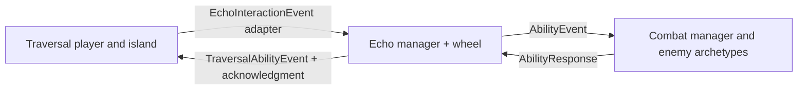

# Local three-system integration

Open this checkout's `project.godot` and press F5, or open
`integration/team_game.tscn` and press F6. This is the combined playable scene.
It starts with every Echo power unlocked for testing, not story progression.

## Branches imported

This worktree is `C:/Users/halib/Documents/Echo_Island_Integrated`, on local branch
`integration/echo-team`. It shares Git history with `Echo_Island_Game` but has its
own files and project settings. The original checkout stays on `Echo_System`.

Merged on September 25, 2026:

- Echo_System: `c08892c` — Echo wheel, all powers and standalone tests.
- Travel_System: `d347283` — expanded island, player, camera, interactions, checkpoints.
- Combat_System: `dcb4cd1` — enemy archetypes, health/defense/status states and Echo receiver.

Remote `main` is still the initial project (`e896afc`). These merges and the new
composition scene are local; no changes have been published to main or team branches.

## How the systems fit together

`team_game.gd` is the composition root: it instantiates Traversal's actual
`scenes/test/art_test.tscn`, keeps its player model/camera/checkpoints, attaches one
Echo manager and one Combat manager, and connects their interfaces once.
Do not combine all three standalone demos: that creates competing players,
cameras, input bindings and state owners.



The integration adapters extend the original scripts. They do not overwrite the
team's source files:

- `player_adapter.gd` extends Megan's Player. Base camera-relative movement,
  jump, checkpoint and interaction methods remain in use. The adapter adds timed
  Echo movement effects, modal wheel gating and respawn cleanup.
- `input_adapter.gd` extends Echo input, using a center-screen ray when the
  camera captures the mouse and world-surface raycasts for Earth placement.
- `combat_bridge.gd` extends CombatSystem. It applies authoritative player range
  checks and registers dynamically spawned enemies after `_ready`, when Combat's
  target group and ID exist. Original effect routing and responses remain in use.
- `enemy_adapter.gd` extends CombatEnemy with collision/visuals and the input target
  descriptor (`channel`, `prompt`, `set_highlight`). Combat retains all health,
  guard and status logic; its archetype-specific weaknesses are respected.
- `earth_adapter.gd` extends Echo's reference Earth object with variable-height
  placement/support checks for the actual island instead of sandbox coordinates.

The original interaction signal passes `(target, data)` using `echo_type`; the
composition root translates it to Echo's `echo_id`, `object_or_area_id`, and hint.
The original Traversal API accepts an ability name plus data, whereas Echo emits a
Dictionary. The adapter translates the request and sends Echo an acknowledgment.

## Controls and test stations

Arrows or WASD move. Mouse looks around. Space jumps; in water it swims upward.
Hold Tab, hover/use arrows, then release to choose. Q uses the selected power;
E uses the personal power (Time). X dismisses the ancestor. F interacts. R uses
Traversal's checkpoint respawn. Esc toggles free/captured mouse outside the wheel.

Traversal originally uses E for interaction. The combined scene changes that one
InputMap action to F at runtime so it cannot also trigger personal Time. Its
debug G/H ability shortcuts are disabled in this scene. The separate demos retain
their original bindings. The wheel blocks both movement and spell charging.

Near the starting beach are Earth rocks/platforms, a Wind vent, a stream, a moving
Time relic, and a raised water basin with entry steps. The basin supplies actual
swimming depth without cutting holes in Megan's authored island. These environment
fixtures reuse Echo's reference receivers pending final level-object integration.

Combat targets use the team's real rules:

| Enemy | Required Echo | Team-owned reaction |
| --- | --- | --- |
| Shellguard | Earth | 2.5-second stun and broken guard |
| Skitter | Wind | Directional knockback |
| Scout | Water | 3.5-second freeze |
| Slinger | Time | 4-second slow at 35% movement speed |

Aim at enemies with the center crosshair. Left-click within 3 units performs a
small integration-test strike through Combat's `take_damage`; an intact shellguard
can block it. Enemy health, defeat and reactions are not duplicated in Echo.
Combat's authoritative durations take precedence over Echo's proposed tuning.

## Boundaries still needing team decisions

- Combat's latest branch enters ATTACK state but does not yet deliver player
  damage. There is no integrated player health/death loop. The test strike is a
  temporary caller of Combat's existing API, not a full attack/animation system.
- The island's collectible relics remain exploration collectibles, not the four
  Echo stones. Stone placement and generation transitions need story/level ownership.
- The shared game has no coordinated save system yet. Runtime Earth changes survive
  switching/respawning; the original Echo playground still has its own save slot.
  A future save coordinator must validate and restore each owner's state together.
- Final island objects can replace the practice fixtures through the same target
  descriptors/events. Do not apply flat-sandbox serialization bounds to island objects.
- Agree on target IDs, input bindings, effect names and durations before merging
  integration into remote main. Keep health and enemy status in Combat; movement
  and checkpoints in Traversal; unlocks, cooldowns and knowledge in Echo.

## Recommended Git workflow

Continue each owner's development on their system branch. Review shared connection
changes on this integration branch, test together, then use a reviewed PR to main.
Avoid merging another system directly into Hali's Echo-only branch.

To update this local combined checkout (first commit or otherwise preserve any
current integration edits):

```text
git fetch origin
git merge origin/Echo_System
git merge origin/Travel_System
git merge origin/Combat_System
```

The existing push hook remains Echo-only and deliberately blocks this integration
branch. It has not been disabled or bypassed. Publishing integration needs a
separately reviewed Git workflow; do not force it through Echo's branch or main.
The integration branch has no upstream, avoiding accidental main pushes.

## Verification

```text
godot --headless --path . --script res://integration/tests/run_tests.gd
godot --headless --path . --script res://systems/echo/tests/run_tests.gd
godot --headless --path . --script res://systems/echo/tests/run_powers_tests.gd
godot --headless --path . res://integration/team_game.tscn --quit-after 180
```

Integration tests exercise the actual team player/Combat code, all four archetype
responses, cooldown success/rejection, dynamically added/freed targets, hint
translation, wheel/input conflict handling, Wind movement, Water/Time environment
effects, checkpoints, persistent Earth changes, and Combat-owned damage/death.

The team's `systems/combat/tests/run_tests.gd` prints success but emits cleanup
warnings because its smoke-test objects/resources are not freed before exit.
Those warnings are in that original test harness; the combined scene and integration
suite exit cleanly. That file is preserved for the Combat owners to fix.
